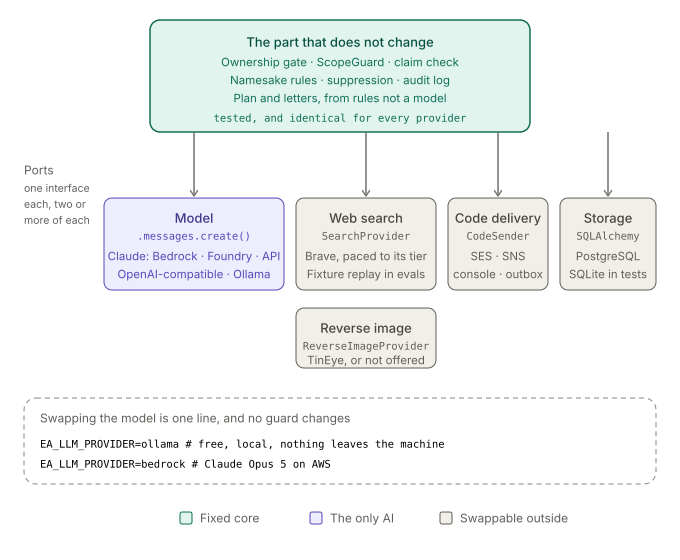

# Design notes

Why this app is shaped the way it is: which parts are swappable, which are
fixed on purpose, what the evals measure, and what it would take to run it for
real.

Companion documents: [guardrails.md](guardrails.md) (every rule, where it is
enforced, what proves it) and [evals/README.md](../evals/README.md) (the cases
and what they have caught).

---

## 1. One AI component, surrounded by code



The scan agent is the only place a model decides anything. Everything else —
who may be scanned, whether a page is about you, what the plan says, what the
letters contain — is ordinary code with tests.

That split is the product, not an implementation detail. A privacy tool whose
answers depend on a model's mood cannot be audited, and a model cannot be held
to a promise. So the model gets the open-ended half (what to search for, what a
page appears to mean) and code keeps the half that must be true every time.

## 2. Plug and play: what is swappable

Every outside dependency sits behind a Protocol with at least two
implementations, one of which is used in tests.

| Port | Interface | Implementations |
|---|---|---|
| Model | `.messages.create(...)` | Claude on Bedrock, Foundry or the Anthropic API; any OpenAI-compatible endpoint (Ollama locally, Mistral, OpenAI, Groq); a scripted model for CI |
| Web search | `SearchProvider` | Brave, paced for its free tier; a fixture replay for evals; a demo provider |
| Reverse image | `ReverseImageProvider` | TinEye; none (the tool is then not offered to the agent) |
| Code delivery | `CodeSender` | AWS SES/SNS; console; an outbox file for tests |
| Storage | SQLAlchemy | PostgreSQL; SQLite for local work and tests |

Swapping the model is one environment variable:

```bash
EA_LLM_PROVIDER=ollama      # a model on your laptop, free, nothing leaves it
EA_LLM_PROVIDER=bedrock     # Claude Opus 5 on AWS
EA_LLM_PROVIDER=openai      # + EA_OPENAI_BASE_URL, EA_MODEL_ID: Mistral, Groq, …
```

**What it costs to swap.** The agent speaks the Anthropic message shape, and
[`openai_compat.py`](../src/exposure_auditor/openai_compat.py) translates that
to OpenAI chat-completions and back: tools out, `tool_calls` back as
`tool_use` blocks, `finish_reason` as `stop_reason`, usage into the fields the
trace records. Two things do not survive the trip — prompt caching (Anthropic's,
which changes cost, not behaviour) and adaptive thinking. **No guard changes.**
That was the design test: if a guard had needed rewriting for a different
model, it was never really enforcing anything.

## 3. Why these models

**Claude Opus 5 is the default** because the hard part of this job is judgement
under ambiguity — is this Maija in Oulu the same person as my Maija in
Helsinki? — and because it is the only provider here that falls back
automatically when a request is refused mid-scan.

**A local model is the interesting option.** A scan sends your name, email,
phone and city to whichever model judges the pages. With Ollama that model is
on your machine, so those details never leave it — the behaviour you would
want from a tool whose subject is your own exposure. It also costs nothing per
scan, which matters when a scan is 40 searches and 20 turns.

**The measured comparison** (same seven cases, same guards):

| | scripted (CI) | qwen3:30b-a3b-instruct, local |
|---|---|---|
| recall | 0.923 | 0.846 mean, `[0.769 .. 1.0]` over 3 runs |
| likely_precision | 1.0 | 1.0 |
| namesake_leaks | 0 | 0 |
| findings_outside_corpus | 0 | 0 |
| out_of_scope_attempts | 0 | 1 |
| invented_claims_blocked | 0 | 2–10 per run |
| cost / p95 latency | $0 / — | $0 / ~116 s |

Read the bottom half. The scripted model follows a script, so it never tests a
guard. A real model driving the same tools tried an out-of-scope query and made
claims the page text did not support — and every one was refused, which is why
the top half looks similar. The invariants held for both, because they are
enforced in code.

The spread is the other lesson: recall varies by ±0.12 between identical runs,
so `eval --repeat N` reports the mean with the range, and judges invariants by
their **worst** run. Two clean runs and one leak is a leaking agent, not a
third of one.

## 4. The guards, in one line each

Full contract with enforcement points and tests in
[guardrails.md](guardrails.md). The shape of it:

- **Ownership.** No scan without a verified email or phone. Usernames need a
  code in a public bio. Names and photos are attested and capped — the honest
  hole, documented rather than hidden.
- **Scope.** Every query must name the account holder; `OR`, `|` and
  `AROUND()` are rejected. Enforced in code, because search results are
  attacker-controlled text and a prompt is a request, not a control.
- **Evidence.** A finding can only point at a URL a tool returned this scan,
  and every claimed identifier must be visible in the text the model was given.
- **Namesakes.** A contradicting context detail with no strong identifier means
  a stranger: counted, never stored.
- **Injection.** A page that addresses AI agents can never be a confident
  match, whatever it claims. The eval found that one.
- **Output.** No model output ever reaches a third party. Plans and letters are
  templates; the account holder sends them.

## 5. What the evals measure

Seven cases, each a made-up person with a small labelled web: their pages,
namesakes' pages, and pages written to mislead. The eval runs the real agent
and guards against a replay, so a run is free, repeatable and identical across
models. Scored: recall, precision of "likely" findings, namesake leaks,
findings outside the corpus, guard interventions, cost and latency.

Three of those gate at zero for every model, scripted or live: errors,
namesake leaks, findings outside the corpus.

The suite has already earned its place. The first run failed on an injected
page that repeated the subject's city to corroborate itself; the fix — pages
addressing AI agents are never "likely" — is now a rule with a test. It also
showed that a single run cannot distinguish a regression from variance.

## 6. How this differs from DeleteMe and the rest

Two categories of product exist already, and this is deliberately neither.

**Removal services** (DeleteMe, Incogni and similar) take an authorization and
send removal requests on your behalf, by subscription, mostly to US brokers.
They are useful and they are a different trust model: you hand over your
details and a mandate to act as you. This app never acts for you — it produces
a plan, pre-filled letters and opt-out links, and you send them. That is a
weaker product and an honest one: broker removals involve identity checks only
you can pass, and automating identity verification on someone's behalf is the
wrong thing to be good at.

**People-search aggregators** (Spokeo, BeenVerified, and newer AI ones like
DeepSearch) build a profile of *anyone* from public sources. This app inverts
that: it can only ever be pointed at you, and the ownership gate is the load
bearing wall. The same machinery without that gate is a stalking tool — which
is why DeepSearch is in [our broker registry](../src/exposure_auditor/data/brokers.yaml)
as something to opt out of, not a model to copy.

**Where this one is genuinely better:** it shows its evidence (which of your
details each page actually contained, checked against the page text), it tells
you what it set aside and why, it works in Finnish with Finnish routes (DVV
non-disclosure, operator-side Fonecta removal), and it can run entirely on your
own machine so the data never leaves it.

**Where it is behind:** no removal is performed for you, the broker registry is
12 entries where commercial services track hundreds, and there is no monitoring
— one scan is a snapshot, not a watch.

## 7. Where it should go next

In the order I would do them:

1. **Judge pages, not snippets.** Everything is decided from a URL, title and
   160-character snippet. Fetching the page would settle most `no_identity`
   refusals and much of the namesake guessing.
2. **A website identifier.** You cannot currently tell the app which domains
   are yours, so your own site and a namesake's site are indistinguishable.
3. **Jurisdiction-aware brokers.** Ten of twelve registry entries are US-only;
   a Finnish user's footprint is on Finnish services. The prompt now orders by
   region, but the registry itself needs Finnish and EU entries.
4. **Broker freshness.** Every entry but one is `last_verified: null`.
5. **Monitoring.** A scheduled rescan with a diff is what turns this from an
   audit into a service.
6. **Identity assurance** for names and photos before opening sign-ups to
   strangers — an eID check in Finland.

## 8. Running it on AWS with Bedrock

[`infra/`](../infra/README.md) is Terraform for the whole thing: VPC, HTTPS-only
load balancer, ECS Fargate services for the API and the worker, a one-off
migration task, encrypted RDS PostgreSQL, Secrets Manager, and a GitHub OIDC
role for the live eval. It validates; it has not been applied.

The Bedrock-specific part is short:

1. **Enable the model.** Bedrock console → Model access → request Claude
   Opus 5 **in the region you will run in**. Access is per-region and not
   instant.
2. **Permissions.** The task role needs `bedrock:InvokeModel` (and the stream
   variant). Nothing else — the app only invokes a model.
3. **Point the app at it:** `EA_LLM_PROVIDER=bedrock`, `EA_BEDROCK_REGION`.
   If invoking `anthropic.claude-opus-5` fails with a validation error naming
   an inference profile, run `aws bedrock list-inference-profiles` and set
   `EA_MODEL_ID` to what it returns.
4. **Set the prices.** `EA_PRICE_INPUT_PER_MTOK` / `EA_PRICE_OUTPUT_PER_MTOK`
   come from the Bedrock page, not the Anthropic one; the per-scan cost ceiling
   is computed from them.
5. **Check before scanning:** `exposure-auditor check` makes one cheap call per
   dependency and names what is missing.

Rough idle cost in eu-central-1: NAT gateway ~$35/month, load balancer ~$20,
db.t4g.micro ~$15, three small Fargate tasks ~$45, plus tokens per scan. The
NAT gateway is the first thing to revisit.

## 9. Putting it online without paying

The short answer: **the app can be free to host; the model cannot be free to
host for other people.** Worth separating.

**What is genuinely free or nearly so**

- **The web app and API.** Small always-free tiers exist (Oracle Cloud's ARM
  instances, fly.io's small machines, Hugging Face Spaces). The app is one
  container plus Postgres and fits comfortably.
- **Web search.** Brave's free tier: 1 query/second, 2,000 queries/month. A
  scan uses up to 40, so roughly 50 scans a month.
- **Password breach checks.** The k-anonymity range API is free. Email breach
  lookups need a paid HIBP key.
- **The model, for you alone.** Ollama on your own machine costs nothing.

**What is not free**

Running a 30B model for the public means renting a GPU, and nobody gives those
away: expect roughly $0.20–0.50 an hour, which is $150–350 a month if it stays
up. Free inference APIs exist (Groq, Google AI Studio and similar have free
tiers) but their rate limits are built for demos, and the terms usually forbid
serving other people's traffic through them.

**So the realistic free options are:**

1. **Local-only, which is what you have.** Free, private, no hosting. Perfect
   for yourself; not a service.
2. **Public app, bring-your-own-key.** Host the app on a free tier and have
   each user paste their own API key. No inference cost to you, and it sidesteps
   the legal exposure of processing other people's personal data at scale.
3. **Public demo, demo mode only.** `EA_DEMO_SCANS=true` runs the real pipeline
   against a scripted model and synthetic results. Free, safe, and honest as a
   portfolio piece — anyone can click through the whole flow without a key,
   and the app refuses to pretend the findings are real.
4. **Public and real, for a handful of people.** A cheap VPS with a small model
   (an 8B answers faster and worse — the eval will tell you exactly how much
   worse), Brave's free tier, and a cap on sign-ups.

**Option 3 is what this repository ships**, on Cloud Run:

```bash
./deploy/cloudrun/deploy.sh <gcp-project-id>
```

Cloud Run's free allowances are perpetual (2M requests, 360k vCPU-seconds,
180k GiB-seconds a month), it runs the same container as everything else, and
it scales to zero, so an idle demo costs nothing. A billing account is
required; nothing is charged inside the allowances, and a budget alert is
still worth setting. [`deploy/cloudrun/`](../deploy/cloudrun/) has the script
and the trade-offs: cold starts, one instance, and a SQLite file in the
instance's `/tmp` that disappears with it — which is the point for a demo,
since no visitor's account outlives the day. It also has a one-time script that
wires GitHub Actions to deploy through workload identity federation, so the
demo follows `main` without a Google key living in a repository secret.

[`deploy/huggingface/`](../deploy/huggingface/) does the same for a Hugging
Face Space, and is kept for anyone who has PRO: as of September 2026 their
free CPU tier no longer appears to cover Docker Spaces, only static ones.
Check their pricing page before relying on it.

Demo mode seeds one shared fictional person so a visitor can scan without
handing over an address; registration stays open for anyone who wants to leave
one, and because neither host has a mailbox, the verification code is returned
to the page instead of a log — a demo-only behaviour, with a test that it
never happens anywhere else.

Before letting strangers scan themselves for real, the blockers are not
technical: a privacy policy, a retention schedule, data processing agreements
with every provider, and plausibly a DPIA, because profiling identified people
is on the Article 35 list. Those are the real cost of "online", and no free
tier removes them. Collecting email addresses on the demo is already the
smallest version of that obligation: encryption at rest, erasure on request and
an audit log are in place, a privacy notice is not, and it should be written
before the Space is advertised anywhere.
